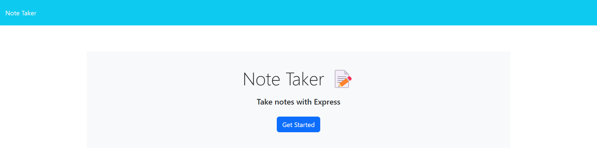
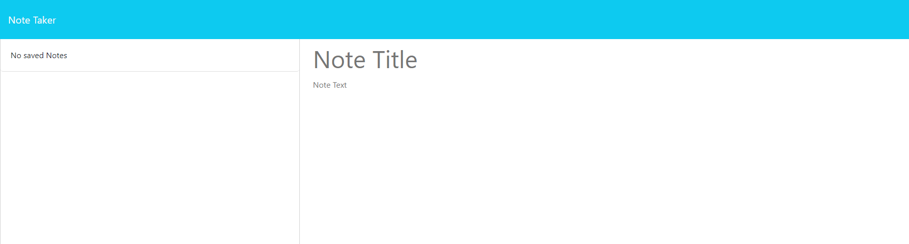

# Note Taking Application

## This repository contains a simple Note Taker application built using Node.js and Express. The application allows users to create, save, and delete notes interactively.

## Table of Contents
- [Installation and Usage](#installation-and-usage)
- [Screenshots](#screenshots)
- [Features](#features)
- [Project Structure](#project-structure)
  - [app.js](#appjs)
  - [routes/index.js and routes/notes.js](#routesindexjs-and-routesnotesjs)
  - [public/notes.html and public/index.html](#publicnoteshtml-and-publicindexhtml)
  - [assets/js/index.js](#assetsjsindexjs)
  - [assets/css/styles.css](#assetscssstylescss)
- [Usage](#usage)
- [Notes](#notes)

<hr>
<br>

## Screenshots


.png)


## Installation and Usage
1. Clone the Repository:
    > ```git clone https://github.com/Evan8383/express-note-taking-app```
2. Navigate to the Project Directory:
    > ```cd express-note-taking-app```
3. Install Dependencies:
    > ```npm install```
4. Run the Application:
    > ```node server.js```
    ##### The server will be accessible at http://localhost:3002 if run locally.

## Features
- Create Notes: Enter a note title and text to create a new note.
- Save Notes: Save created notes to the application.
- Delete Notes: Remove unwanted notes from the list.

## Project Structure
### app.js
- This file serves as the main entry point for the application. It sets up the Express server, middleware, and routes.

### routes/index.js and routes/notes.js
- These files define the main router and note-specific router, respectively. The note router handles operations such as retrieving, adding, and deleting notes.

### public/notes.html and public/index.html
- These HTML files provide the basic frontends for note management. index.html serves as the landing page, and notes.html displays the list of notes.

### assets/js/index.js
- The JavaScript file contains client-side logic for handling user interactions on the note-taking interface.

### assets/css/styles.css
- This CSS file provides styling for the application interface.

## Usage
1. Access the application at http://localhost:3002.
2. Click "Get Started" to go to the note-taking interface.
3. Enter a note title and text, then click "Save Note" to save the note.
4. Existing notes will be listed on the left side. Click on a note to view or delete it.
5. Use the "New Note" button to start a new note, and the "Clear Form" button to reset the form.

## Notes
    - The server runs on port 3002 by default but can be configured using the PORT environment variable.

    - The application uses Express for the server and basic HTML, CSS, and JavaScript for the frontend.

    - Customize the code according to your needs and requirements.
    
    - Feel free to explore, modify, and enhance this simple Note Taker application!